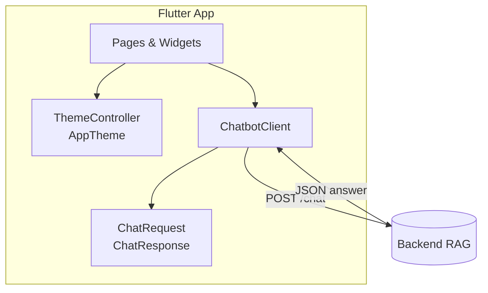
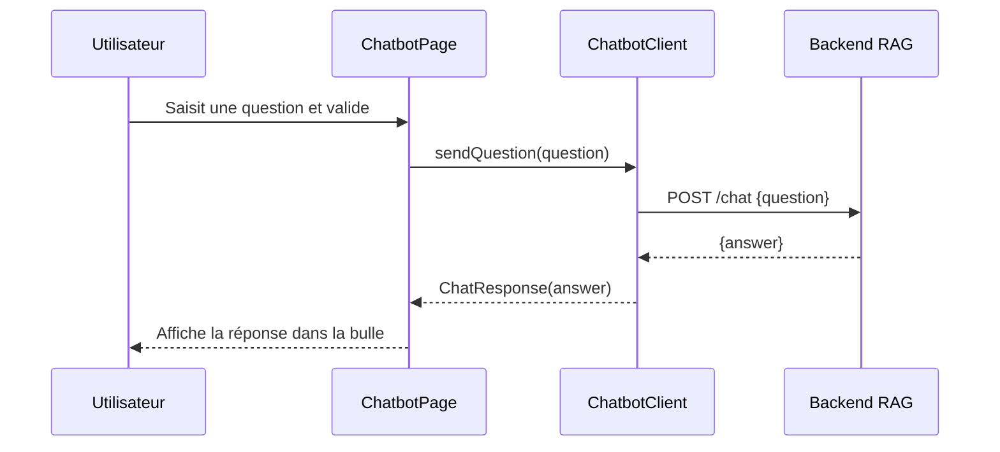
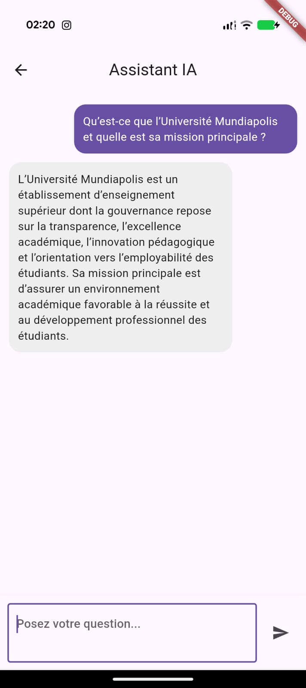
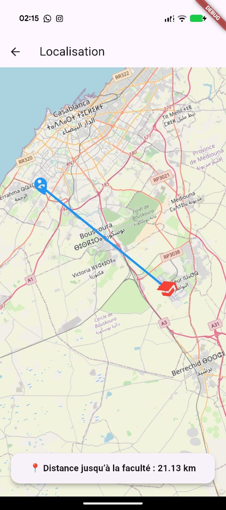
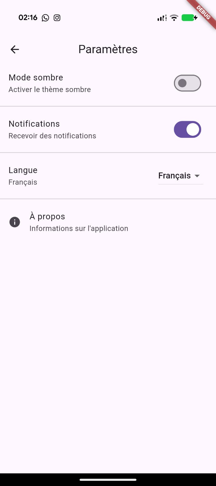
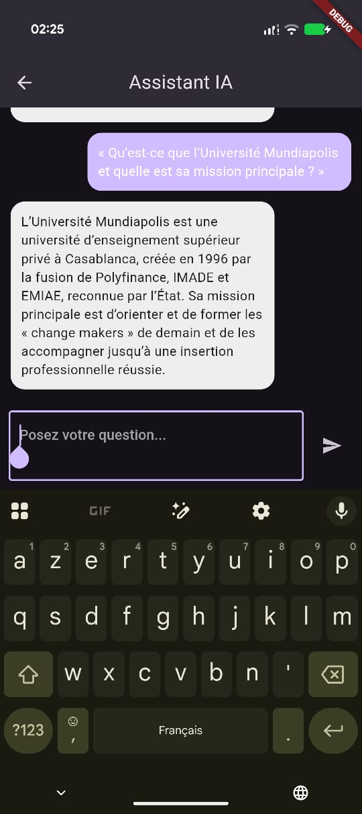
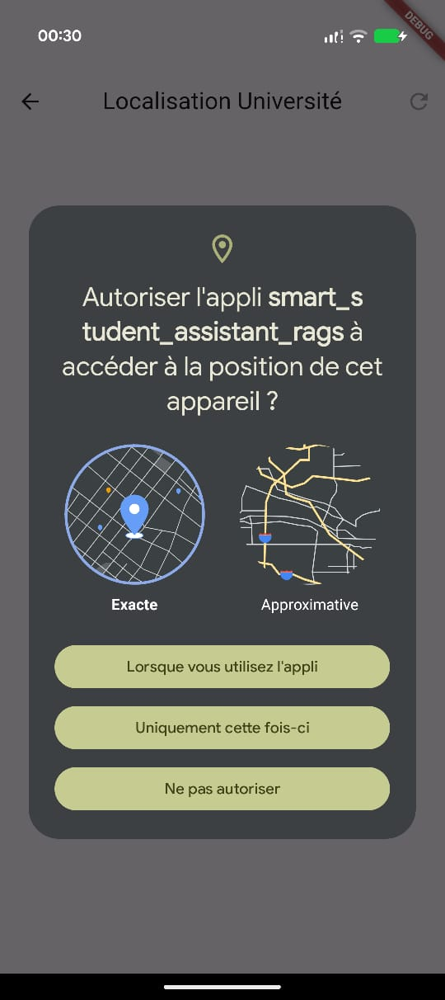
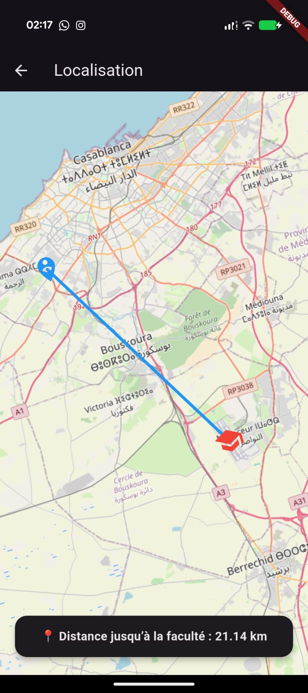
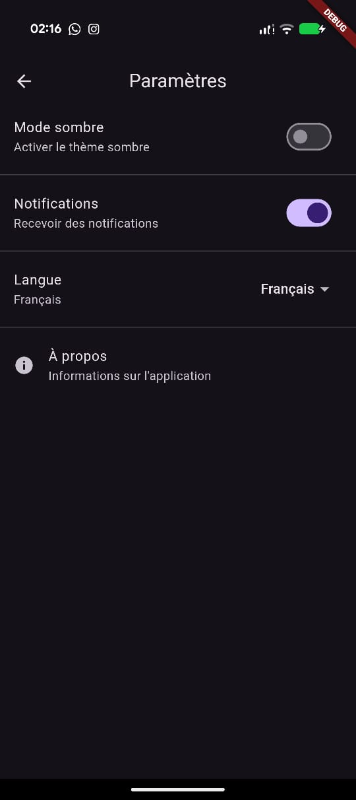

# Smart Student Assistant (RAGs)

Assistant étudiant multiplateforme développé avec Flutter. L’application combine une navigation par tiroir, un mode clair/sombre global et une intégration d’API (Retrofit + Dio) pour dialoguer avec un chatbot supporté par un backend RAG.

---

## 🚀 Description générale

Smart Student Assistant accompagne les étudiants de l’Université Mundiapolis dans leur quotidien : informations sur l’université, localisation, profil, paramètres, et surtout un chatbot pédagogique connectant l’étudiant à une base de connaissances académique.

---

## 🧩 Fonctionnalités principales

- **Navigation par Drawer** : accès rapide aux pages Accueil, À propos, Carte, Paramètres, Profil et Chatbot.
- **Assistant IA** : formulaire de questions/réponses reposant sur un backend RAG, appels via Retrofit et Dio @lib/pages/chatbot_page.dart#1-159 @lib/services/chatbot_client.dart#1-14.
- **Localisation & distance** : calcul de la distance utilisateur–campus via `geolocator` + affichage sur OpenStreetMap @lib/pages/map_page.dart#1-162.
- **Mode clair/sombre dynamique** : `ValueListenableBuilder` + `ThemeController` pour basculer entre deux thèmes Material @lib/main.dart#1-27 @lib/theme/app_theme.dart#1-13.
- **Pages informatives** : cartes descriptives, ressources universitaires et profil étudiant @lib/pages/about_page.dart#1-150.

---

## 🏗️ Architecture applicative

| Couche | Description |
| --- | --- |
| **UI (pages & widgets)** | Pages Flutter (`lib/pages/`) + Drawer (`lib/widgets/app_drawer.dart`) pour la navigation contextuelle. |
| **Thème** | `AppTheme` expose les thèmes clair/sombre, `ThemeController` pilote `ThemeMode`. |
| **Services** | `ChatbotClient` (Retrofit) + `ApiConfig` pour la résolution dynamique du backend. |
| **Modèles** | Objets JSON sérialisables `ChatRequest`/`ChatResponse` générés via `json_serializable`. |
| **Backend RAG (externe)** | Point d’entrée `/chat` répond aux requêtes textuelles (non inclus dans ce dépôt). |

---

## 📊 Diagrammes UML

### 1. Diagramme de composants



### 2. Diagramme de séquence (flux chatbot)



---

## 🗂️ Structure du projet

```
smart_student_assistant_rags/
├── lib/
│   ├── main.dart
│   ├── pages/
│   │   ├── home_page.dart
│   │   ├── about_page.dart
│   │   ├── chatbot_page.dart
│   │   ├── map_page.dart
│   │   ├── profile_page.dart
│   │   └── settings_page.dart
│   ├── services/
│   │   ├── api_config.dart
│   │   ├── chatbot_client.dart
│   │   └── chatbot_client.g.dart
│   ├── models/
│   │   ├── chat_request.dart (+ .g.dart)
│   │   └── chat_response.dart (+ .g.dart)
│   ├── theme/
│   │   ├── app_theme.dart
│   │   └── theme_controller.dart
│   └── widgets/
│       └── app_drawer.dart
├── images/ (captures d’écran & assets)
├── pubspec.yaml
└── test/
```

---

## 🎨 Captures d’écran

### Mode clair

<table>
  <tr>
    <td></td>
    <td></td>
    <td></td>
  </tr>
  <tr>
    <td></td>
    <td></td>
    <td></td>
  </tr>
  <tr>
    <td></td>
    <td></td>
    <td></td>
  </tr>
</table>

### Mode sombre

<table>
  <tr>
    <td></td>
    <td></td>
    <td></td>
  </tr>
  <tr>
    <td></td>
    <td></td>
    <td></td>
  </tr>
  <tr>
    <td></td>
    <td></td>
    <td></td>
  </tr>
  <tr>
    <td></td>
    <td></td>
    <td></td>
  </tr>
</table>

---

## ⚙️ Installation & exécution

1. **Pré-requis**
   - Flutter 3.x
   - Dart SDK
   - Un backend RAG exposant l’endpoint `POST /chat` (configuré dans `ApiConfig`) @lib/services/api_config.dart#1-18.
2. **Installation**
   ```bash
   flutter pub get
   ```
3. **Lancement**
   ```bash
   flutter run
   ```

### Configuration de l’API

`ApiConfig.baseUrl` ajuste automatiquement l’URL selon la plateforme (émulateur, device physique ou desktop). Adaptez l’adresse IP locale pour pointer vers votre backend.

---

## 🧪 Tests

Lancez la suite Flutter par défaut :

```bash
flutter test
```

---

## 📚 Stack technique

- Flutter (Material 3)
- Drawer navigation + `Navigator` classique
- Dio + Retrofit
- Json Serializable & build_runner
- Geolocator + Flutter Map + OpenStreetMap

---

## 🤝 Contribution

1. Forkez le dépôt
2. Créez une branche de fonctionnalité (`git checkout -b feature/ma-feature`)
3. Commitez (`git commit -m "feat: ajoute ma feature"`)
4. Poussez (`git push origin feature/ma-feature`)
5. Ouvrez une Pull Request

---

Made with ❤️ pour l’Université Mundiapolis.
